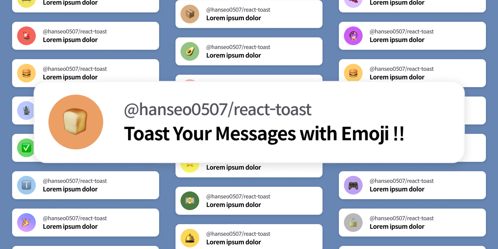

# @hanseo0507/react-toast

[](https://badge.fury.io/js/@hanseo0507%2Freact-toast)



## Installation

```sh
yarn add @emotion/react @emotion/styled framer-motion
yarn add @hanseo0507/react-toast
```

## Example

### Demo

```tsx
// src/main.tsx
import React from 'react';
import ReactDOM from 'react-dom/client';

import { ToastProvider } from '@hanseo0507/react-toast';

import App from './App';

ReactDOM.createRoot(document.getElementById('root') as HTMLElement).render(
  <React.StrictMode>
    <ToastProvider>
      <App />
    </ToastProvider>
  </React.StrictMode>
);
```

```tsx
import React from 'react';

import { useToast } from '@hanseo0507/react-toast';

function App() {
  const { toast } = useToast();

  return (
    <div>
      <button onClick={() => toast.info('Awesome Toast!')}>🍞 Toast!</button>
    </div>
  );
}

export default App;
```

### Use Cases

#### useToast

```tsx
import { ToastOptions, ToastPosition } from '@hanseo0507/react-toast';

const options: ToastOptions = {
  position: ToastPosition.topRight,
  duration: 3000, // 3s
};

/// default
toast({ emoji: '🎉', emojiBackground: '#ECA0FF', text: 'Awesome Toast!' }, options);

// with linear-gradient
toast({ emoji: '🎉', emojiBackground: ['#ECA0FF', '#778DFF'], text: 'Awesome Toast!' }, options);

// linear-gradient with degree
toast(
  { emoji: '🎉', emojiBackground: ['70deg', '#ECA0FF', '#778DFF'], text: 'Awesome Toast!' },
  options
);

// Info Toast -> { emoji: "ℹ️", emojiBackground: "#A0C9F0" } will be set
toast.info('Info Tost!', options);

// Success Toast -> { emoji: "✅", emojiBackground: "#6AD76A" } will be set
toast.success('Success Tost!', options);

// Warning Toast -> { emoji: "🚧", emojiBackground: "#F3E45C" } will be set
toast.warn('Warning Tost!', options);
toast.warning('Warning Toast!', options);

// Error/Danger Toast -> { emoji: "🚨", emojiBackground: "#F3655C" } will be set
toast.danger('Warning Tost!', options);
toast.error('Warning Toast!', options);
```

### ToastProvider

```tsx
import { ToastProvider, ToastPosition } from '@hanseo0507/react-toast';

<ToastProvider position={ToastPosition.topRight} duration={3000}>
```

## API Reference

### ToastOptions

| Required | Key      | Type          | Default Value          | Description              |
| :------: | -------- | ------------- | ---------------------- | ------------------------ |
|    ❌    | position | ToastPosition | ToastPosition.topRight | Default toast position   |
|    ❌    | duration | number        | 3000                   | Toast duration time (ms) |
